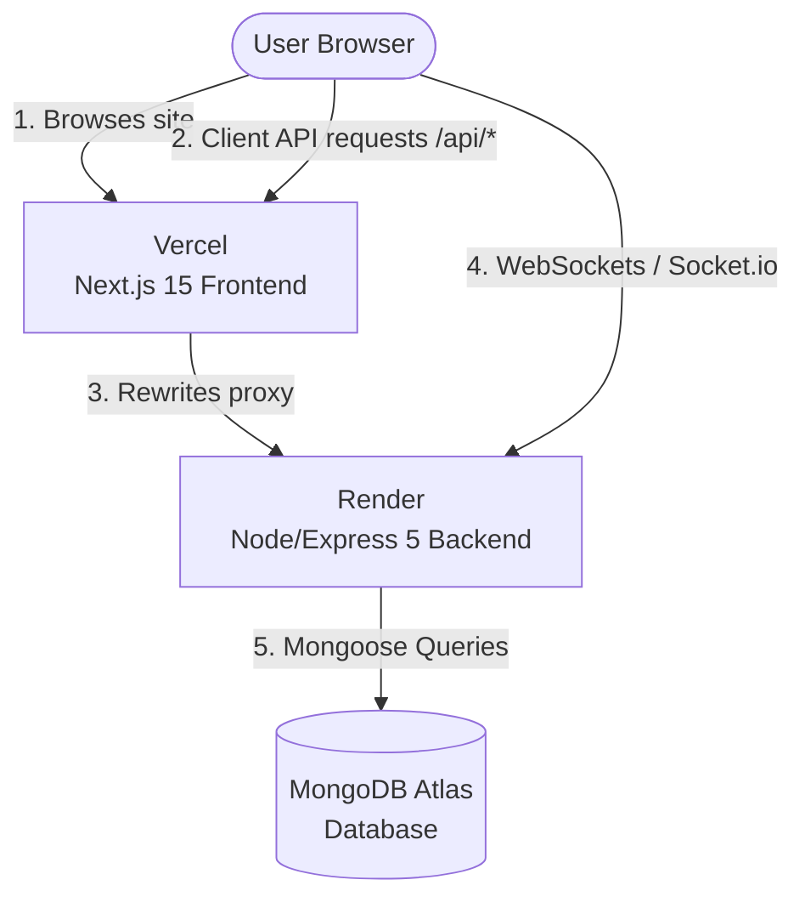

# 🚀 Deployment Guide: Render & Vercel

This guide outlines the step-by-step process for deploying the full-stack Cryobyte ITSM application. The architecture is split into a **Next.js 15 Frontend** hosted on Vercel and a **Node.js/Express 5 Backend** hosted on Render, both connecting to a **MongoDB Atlas** database.

---

## 🏗️ Deployment Architecture

- **Client-Side API Requests:** Handled seamlessly via Next.js `rewrites` configured in [next.config.ts](file:///d:/cursor-dev/cryobyte-itsm/frontend/next.config.ts). When the browser requests `/api/v1/...`, Vercel proxies it to the backend.
- **WebSockets (Socket.io):** Client-side socket connections connect directly to the backend URL to allow full duplex communication for the real-time presence system.

---

## 🗄️ Phase 1: Database Setup (MongoDB Atlas)

The backend relies on MongoDB for storing ticket data, assets, and user sessions.

1. **Create an Account / Log In:** Go to [MongoDB Atlas](https://www.mongodb.com/cloud/atlas) and log in.
2. **Create a Cluster:**
   - Deploy a free tier Shared Cluster (M0) in your preferred region.
3. **Configure Database Access:**
   - Create a database user (e.g., `db_user`).
   - Choose **Password** authentication and generate a strong password. Note this password down.
4. **Configure Network Access:**
   - In the sidebar under **Security**, select **Network Access**.
   - Click **Add IP Address**.
   - > [!WARNING]
     > Because Render's free tier outgoing IP addresses are dynamic, you must whitelist all IPs by adding `0.0.0.0/0` (Allow Access from Anywhere). Alternatively, if you upgrade to Render's static outbound IP plans, you can whitelist specific IPs.
5. **Get the Connection URI:**
   - Go to the database dashboard, click **Connect**.
   - Select **Drivers** (Node.js).
   - Copy the connection string (looks like `mongodb+srv://<username>:<password>@cluster0.xxxx.mongodb.net/?retryWrites=true&w=majority`).
   - Replace `<username>` and `<password>` with your created database credentials.

---

## ⚙️ Phase 2: Backend Deployment (Render)

The backend server is deployed as a **Render Web Service** pointing to the `/backend` subdirectory.

### 1. Create a New Web Service

1. Log in to [Render](https://render.com/).
2. Click **New +** and select **Web Service**.
3. Connect your GitHub repository.

### 2. Configure Service Settings

Specify the following configuration to ensure Render compiles only the backend:

| Setting            | Value                               | Description                                                                                                             |
| :----------------- | :---------------------------------- | :---------------------------------------------------------------------------------------------------------------------- |
| **Name**           | `cryobyte-itsm-backend`             | Name of your Render web service                                                                                         |
| **Region**         | Choose nearest to database          | Location of deployment server                                                                                           |
| **Branch**         | `main` (or your development branch) | Git branch to deploy                                                                                                    |
| **Root Directory** | `backend`                           | **Crucial:** Targets the `/backend` folder                                                                              |
| **Runtime**        | `Node`                              | Execution runtime                                                                                                       |
| **Build Command**  | `npm install`                       | Installs backend dependencies                                                                                           |
| **Start Command**  | `npm start`                         | Runs `node src/index.js` as defined in [backend/package.json](file:///d:/cursor-dev/cryobyte-itsm/backend/package.json) |

### 3. Add Environment Variables

Under the **Environment** tab, click **Add Environment Variable** and configure:

| Key              | Example Value                      | Description                                                              |
| :--------------- | :--------------------------------- | :----------------------------------------------------------------------- |
| `NODE_ENV`       | `production`                       | Set environment mode to production                                       |
| `MONGO_URI`      | `mongodb+srv://...`                | Connection URI obtained from MongoDB Atlas                               |
| `JWT_SECRET`     | _[Random 64-character hex]_        | Used to sign auth JWTs                                                   |
| `FRONTEND_URL`   | `https://cryobyte-itsm.vercel.app` | **Crucial:** The URL of your Vercel frontend (needed for Socket.io CORS) |
| `GEMINI_API_KEY` | `AIzaSy...`                        | API key for AI assistant features                                        |
| `GITHUB_TOKEN`   | `ghp_...`                          | GitHub API token for repository integrations                             |
| `PORT`           | `10000`                            | _Optional_ (Render automatically injects `PORT`)                         |

> [!IMPORTANT]
> **Socket.io CORS Matching:** The `FRONTEND_URL` variable **must** exactly match your deployed Vercel URL. If they do not match, Socket.io client connections will fail with a CORS error. See [backend/src/config/socket.js](file:///d:/cursor-dev/cryobyte-itsm/backend/src/config/socket.js) to view the configuration.

### ⚠️ Render Free Tier Limitations & Agenda Jobs

> [!WARNING]
>
> - **Cold Starts:** Under Render's Free tier, the service spins down after 15 minutes of inactivity. The next request triggers a cold start which can take **50+ seconds** to boot.
> - **Scheduler Execution:** Background tasks managed by [backend/src/jobs/index.js](file:///d:/cursor-dev/cryobyte-itsm/backend/src/jobs/index.js) (such as the SLA watchdog `check-sla-breaches` which runs every 60 seconds) **will stop executing** while the server is asleep.
> - **Mitigation:** For reliable SLA monitoring and instant response times, upgrade the backend to a paid tier (e.g., "Individual" / "Starter") or use a third-party pinging service (like UptimeRobot) to keep the endpoint alive.

---

## 💻 Phase 3: Frontend Deployment (Vercel)

The Next.js frontend is deployed to Vercel, targeting the `/frontend` directory.

### 1. Create a New Vercel Project

1. Log in to [Vercel](https://vercel.com/).
2. Click **Add New** -> **Project**.
3. Import your GitHub repository.

### 2. Configure Project Settings

Before clicking deploy, adjust the settings to target the Next.js subdirectory:

- **Framework Preset:** `Next.js`
- **Root Directory:** Click Edit and select `frontend`.
- **Build Command:** `npm run build` (runs Next.js build script defined in [frontend/package.json](file:///d:/cursor-dev/cryobyte-itsm/frontend/package.json))
- **Install Command:** `npm install`

> [!NOTE]
> **Memory Allocation & Typescript Checks:** To prevent Out Of Memory (OOM) compilation crashes in restricted deployment environments, the project is configured in [frontend/next.config.ts](file:///d:/cursor-dev/cryobyte-itsm/frontend/next.config.ts) to bypass TypeScript and ESLint checks during the build step (`ignoreBuildErrors: true` and `ignoreDuringBuilds: true`). Static checks are instead fully validated in the GitHub CI pipelines.

### 3. Add Environment Variables

Add the environment variables required for the frontend build:

| Key                   | Value                                        | Description                                 |
| :-------------------- | :------------------------------------------- | :------------------------------------------ |
| `NEXT_PUBLIC_API_URL` | `https://cryobyte-itsm-backend.onrender.com` | The URL of your deployed Render Web Service |

Click **Deploy** and wait for the build to complete. Vercel will output a unique deployment URL (e.g., `https://cryobyte-itsm.vercel.app`).

---

## 🔄 Phase 4: Verification & Linkage

Once both deployments are successful, perform the following validation steps:

1. **Update Backend CORS Configuration:**
   - Go back to Render's Environment tab for your web service.
   - Edit the `FRONTEND_URL` environment variable.
   - Change it to the live Vercel domain (e.g., `https://cryobyte-itsm.vercel.app`).
   - Save and wait for Render to automatically redeploy the service.
2. **Verify CORS Proxy (Next.js Rewrites):**
   - Visit `https://your-vercel-domain.vercel.app/api/test` in your browser.
   - You should receive the backend JSON response: `{"message":"Backend is working"}`.
3. **Verify WebSocket Connection:**
   - Open the browser console (F12 -> Console) on your Vercel app.
   - Verify there are no socket connection or CORS errors.
   - The console should log `[Socket] Connecting to server at: https://your-backend-domain.onrender.com` followed by a successful connection.
